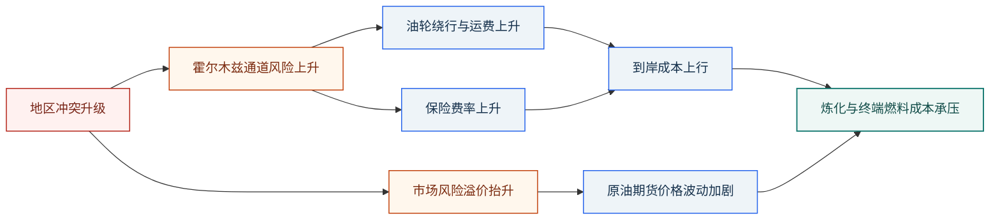

# Research Report

把已经形成的判断写成读者能使用的报告。报告不是材料拼接，而是围绕读者任务、主线判断、证据和不确定性组织出来的交付物。

## 适用模式

按顺序判断：

1. 有 `{report_dir}/synthesis.md`、`plan.json`、`sub_reports/*.md`：走**终稿生成模式**，默认写入 `{report_dir}/report.md`。
2. 没有完整研究链路，但有现成草稿、文稿路径或待修改文本：走**写作修改模式**，默认写回用户指定目标文件。
3. 两者都缺：先要求输入文稿或研究材料，不要硬写。

## 边界

做：

- 按读者、用途和结构约束组织报告。
- 在终稿生成模式下，以 `synthesis.md` 的判断层为主输入写出 `report.md`。
- 在写作修改模式下，忠于原稿事实和核心判断做重写、压缩、扩写、重组或润色。
- 从 supporting notes、子报告或附加材料中抽取表格、案例、数据、时间线和风险点。
- 主动规划视觉节点，并用表格、Mermaid 或 AI 图片降低理解成本。
- 清楚呈现条件、限制、冲突和不确定性。

不做：

- 不在缺少依据时新增关键事实或关键结论。
- 不把写作修改变成重新研究。
- 不把子报告或笔记按顺序拼成终稿。
- 不写脚注、文末参考文献或来源编号。
- 不用 AI 图片承载精确数字、坐标轴、表格或可核验地图。

## 终稿生成模式

输入：

- `{report_dir}/request.md`
- `{report_dir}/plan.json`
- `{report_dir}/synthesis.md`
- 全部 `{report_dir}/sub_reports/*.md`
- 可选：`{report_dir}/images/`

目标：把 `synthesis.md` 中已经想清楚的结论，转成面向目标读者的图文报告。

### 生成流程

不要先写完整正文再事后补图。先设计读者理解路径，再同步规划正文、表格、图表和 AI 配图。

1. **确认读者任务**：从 `request.md` 和 `plan.json.scope` 判断读者要了解全貌、比较选项、调查对象、追踪事件、评估风险还是制定行动。
2. **提炼主线判断**：从 `synthesis.md` 抽出 2-5 条核心判断、证据强弱、关键冲突、不确定性和对原始问题的回答。
3. **搭建章节骨架**：优先遵循 `plan.json.report_shape.sections`；若缺失，按读者任务选择默认结构。每个主章节只回答一个关键问题。
4. **标注章节认知任务**：逐章判断读者需要比较、排序、追踪、定位、归因、分层、决策还是建立语境。
5. **制定并落盘视觉计划**：为候选视觉节点写明 `slot`、`purpose`、`type`、`content_source`、`must_have`，并写入 `{report_dir}/visual_plan.md`；不要把视觉计划写入 `report.md`。长报告默认安排 2-4 个视觉元素，复杂报告可安排 4-7 个。
6. **先落关键图表**：对供应链、传导机制、风险路径、情景矩阵、趋势数据等强结构内容，先做表格或 Mermaid，再写解释，以便暴露逻辑缺口。
7. **嵌入视觉元素**：每张图表前说明为什么看它，图表后提炼读者应带走的判断；视觉元素必须贴近解释它的段落或章节，不要集中堆在文末。
8. **生成 AI 配图**：对视觉计划中选为 AI 图片的概念图、场景图、封面图、地理/产业图景，调用 `sn-image-base` 生成文件并嵌入。
9. **自检并写入**：确认结构完整、结论清楚、`visual_plan.md` 已落盘、视觉类型合理、图片路径可解析，再写入 `report.md`。

如果写作时发现关键事实缺口导致主线无法成立，回到对应研究或综合阶段；不要硬写。

### 默认结构

优先遵循 `plan.json.report_shape.sections` 或用户指定结构。若两者都没有，按任务选择：

- **全景研究**：摘要 -> 背景与范围 -> 核心发现 -> 分维度分析 -> 综合判断 -> 风险与不确定性 -> 下一步。
- **对比选型**：摘要与推荐 -> 评估背景 -> 对比矩阵 -> 逐维度分析 -> 场景化建议 -> 风险与限制。
- **实体调查**：执行摘要 -> 对象概览 -> 关键维度审查 -> 重大风险/机会 -> 综合评价 -> 后续关注。
- **事件追踪**：摘要 -> 时间线 -> 各方立场 -> 影响分析 -> 后续走向 -> 不确定性。

复合意图只保留一个主结构；次要意图压缩成章节或小节。

## 视觉规划

第一性原理：先判断读者面对某段内容要完成的认知任务，再选图。图形的职责是降低比较、排序、追踪、定位、归因、分层、决策或记忆成本。

| 认知任务 / 内容结构 | 最适合的视觉形式 | 使用要点 |
|---|---|---|
| 精确查数、多个对象多个指标比较 | Markdown 表格 | 需要保留精确数字、口径、证据强弱时优先表格 |
| 排名、规模差异、单指标横向比较 | Mermaid `xychart-beta` 柱状图，或表格 | 对象超过 8 个时优先表格；少量对象可用柱状图强化差距 |
| 时间趋势、价格/产量/份额变化 | Mermaid `xychart-beta` 折线/柱状图 | 只在有明确时间点和数值时使用 |
| 事件先后、政策演进、危机升级过程 | Mermaid `timeline` 或时间线表 | 事件多且需要日期时用时间线表；强调阶段变化时用 `timeline` |
| 组成占比、份额结构 | Mermaid `pie` 或表格 | 类别不超过 5 个且合计口径清楚时用饼图；否则用表格 |
| 流程、产业链、供应链、传导机制 | Mermaid `flowchart` | 用箭头表达方向、瓶颈和传导节点；避免把长段文字塞进节点 |
| 因果链、反馈回路、风险扩散路径 | Mermaid `flowchart` 或因果链示意 | 明确触发条件、放大机制和结果；复杂回路可拆成多段 |
| 组织、角色、国家/企业关系网络 | Mermaid `graph` | 表达谁影响谁、谁依赖谁；关系过密时改成分组表 |
| 情景分析、风险矩阵、二维判断 | Markdown 矩阵表；必要时 Mermaid `quadrantChart` | 需要概率、影响、触发条件时优先矩阵表；四象限只用于快速定位 |
| 决策路径、应对策略选择 | Mermaid `flowchart` 或决策树 | 用于“如果 A 则 B”的行动建议，不用于罗列普通建议 |
| 地理位置、战略通道、物流路径 | 真实地图/可核验示意优先；无地图数据时用 Mermaid 示意或 AI 概念图 | AI 图只能建立空间语境，不能承担精确地图职责 |
| 架构、系统分层、能力框架 | Mermaid `flowchart`、分层框架图或表格 | 分层清晰时用框架图；维度和说明多时用表格 |
| 抽象主线、封面、章节开场、行业图景 | AI 概念图 | 用来建立语境和记忆锚点；不承载精确事实、数字或地图 |
| 对比前后状态、演化路径 | 并列表格、时间线或 Mermaid `flowchart` | 需要精确差异用表格；强调转变过程用流程图 |
| 不确定性、证据强弱、假设边界 | 表格、风险矩阵或范围说明 | 避免用单一确定图形制造过度确定的错觉 |

视觉计划必须单独写入 `{report_dir}/visual_plan.md`，不要写入 `report.md`。`report.md` 只保留实际交付给读者的正文、表格、Mermaid 图和图片引用；`visual_plan.md` 用作生成过程记录和质量检查依据。

`visual_plan.md` 建议格式：

```markdown
# Visual Plan

## Context

- report: report.md
- purpose: 一句话说明视觉规划服务的读者任务
- status: planned / partially_applied / applied

## Plan

| slot | purpose | type | content_source | must_have | output |
|---|---|---|---|---|---|
| 执行摘要后 | 建立报告整体语境 | AI 概念图 | 主线判断 | 可选 | images/overview.png |
| 第二章开头 | 展示市场结构或战略通道 | Mermaid 示意图 / AI 概念图 | 子报告 d2 | 必须 | report.md 内 Mermaid |
| 供应影响章节 | 展示冲击传导路径 | Mermaid `flowchart` | 子报告 d3 | 必须 | report.md 内 Mermaid |
| 情景分析章节 | 比较概率、冲击和触发条件 | Markdown 矩阵表 | synthesis + 子报告 d5 | 必须 | report.md 内表格 |

## Notes

- 记录为什么选择或放弃 AI 图、Mermaid、表格。
- 如视觉计划在写作过程中调整，更新本文件，而不是把调整过程写进 `report.md`。
```

计划表字段：

| 字段 | 含义 |
|---|---|
| `slot` | 视觉元素插入或支撑的章节位置 |
| `purpose` | 这张图/表帮助读者完成什么认知任务 |
| `type` | Markdown 表格、Mermaid 图、AI 概念图等 |
| `content_source` | 来自 `synthesis.md`、某个子报告、原稿段落或用户材料 |
| `must_have` | 必须 / 可选 |
| `output` | 最终落点，例如 `report.md 内 Mermaid`、`report.md 内表格`、`images/xxx.png`、`放弃：原因` |

视觉规则：

- 每个主章节通常最多放 1 个视觉元素；信息密度高的章节可放 2 个，且类型要互补。
- 有明确数据、比较、流程、时间线或关系结构时，使用表格或 Mermaid，保证内容可校验。
- 当目标是建立语境、呈现地理/产业图景、解释抽象主线或作为封面/章节开场时，可以使用 AI 概念图。
- 不要默认排除 AI 图；如果章节缺少数据但需要直观语境，应考虑 AI 概念图。
- 不要为了好看生成图片；每个视觉元素必须解释章节主判断、降低理解门槛或建立报告语境。
- 如果最终没有任何 AI 图片，必须是视觉计划判断所有候选位置更适合表格、Mermaid 或文字，而不是省略生图步骤。

### Mermaid 插入格式

在 `report.md` 中直接使用 fenced code block 插入 Mermaid。图前用 1-2 句话说明读者为什么要看这张图，图后提炼应带走的判断。不要只给图不解释，也不要把大量长句塞进节点。

Mermaid 配色遵循：白底、浅灰蓝边框、深青绿主强调、蓝色辅助、橙红表示约束或风险。颜色必须有语义，不做装饰。

| class | fill | stroke | color | 语义 |
|---|---|---|---|---|
| `core` | `#eef7f5` | `#0f766e` | `#134e4a` | 核心判断、主变量、结论 |
| `support` | `#eef4f8` | `#2563eb` | `#17324d` | 支撑因素、传导环节、技术模块 |
| `neutral` | `#ffffff` | `#dbe2ea` | `#1c2430` | 普通对象、中性节点 |
| `muted` | `#f7f8fb` | `#94a3b8` | `#475467` | 次要信息、背景信息 |
| `warning` | `#fff7ed` | `#c2410c` | `#7c2d12` | 约束、瓶颈、成本压力 |
| `risk` | `#fff1f0` | `#b42318` | `#7a271a` | 风险、冲突、负面冲击 |

使用规则：

- 一张图最多使用 3-4 类颜色。
- 主线用 `core`，传导用 `support`，普通节点用 `neutral`。
- 约束用 `warning`，真实风险用 `risk`。
- 同类节点同色；不要给每个节点单独配色。

示例：

````markdown
下图用于说明冲突如何通过航运、保险和预期三个渠道传导到油价，而不是表示精确量化幅度。



读者应带走的判断是：短期价格冲击未必来自实际供应中断，航运成本、保险成本和风险溢价也会先行放大波动。
````

## AI 配图

需要 AI 配图时，依赖并使用已注入的 `sn-image-base` skill。请查阅 `sn-image-base` 的使用说明，并按它当前公开的接口调用 `sn-image-generate`。

依赖规则：

1. 需要生成图片时，先查阅 `sn-image-base` 的 `SKILL.md`；如需精确参数，再查阅它的 `reference/api_spec.md`。
2. 使用 `sn-image-base` 暴露的 `sn-image-generate` 能力实际生成图片文件。
3. 保存路径必须位于 `{report_dir}/images/`，并在 `report.md` 中使用相对路径嵌入。
4. 如果当前运行环境无法加载或调用 `sn-image-base`，不要假装已生成图片；说明依赖不可用，并询问用户是否修复依赖或改用 Mermaid/表格替代。

生成每张图前先确定：

- `slot`：插入位置，例如“摘要后”或“第二章：市场结构开头”。
- `purpose`：这张图帮助读者理解什么。
- `alt`：Markdown alt 文本。
- `filename`：保存到 `{report_dir}/images/` 的文件名，小写字母、数字和连字符，例如 `market-structure.png`。
- `prompt`：图像提示词，包含主题、构图、风格、禁用文字或少文字要求。

调用命令：

```bash
mkdir -p <report_dir>/images
python3 <sn-image-base>/scripts/sn_agent_runner.py sn-image-generate \
  --prompt "<image prompt>" \
  --aspect-ratio "16:9" \
  --image-size "2k" \
  --save-path "<report_dir>/images/<filename>.png" \
  --output-format json
```

调用后确认文件存在且非空，再写入 `report.md`：

```markdown

```

失败处理：

- 不要留下失效图片链接。
- 缺少 API key、base URL、model 或其他必要配置时，先询问用户提供配置，或确认是否改用 Mermaid/表格替代。
- 优先改用 Mermaid、表格或文字说明。
- 在最终回复中说明失败原因和替代方式。

## 写作修改模式

输入：

- 现有草稿文件；或
- 一段待修改文本；或
- 用户明确的修改要求 + 原始文稿路径。

可选补充：目标读者、目标长度、语气、保留/删除要求、希望增强的摘要/结构/表格/结论/逻辑/语言/过渡、supporting notes、素材文件或参考结构。

流程：

1. **识别修改目标**：判断用户是重写、压缩、扩写、润色、重组，还是组合任务。
2. **读取现有文稿**：理解主张、结构、信息密度和主要问题。
3. **锁定不变项**：识别必须保留的事实、观点、术语、口径和结构约束。
4. **决定改写粒度**：小改处理摘要/段落/标题/语句；中改处理章节重组和表格化；大改整体重写但保留事实边界。
5. **执行修改**：优先改结构和逻辑，再改语言和可读性；需要时补表格、清单、时间线或视觉元素。
6. **自检**：确认没有无依据新增关键事实，也没有误改原文立场。
7. **输出修改稿**：默认写回目标文件；如用户要求保留原稿，则输出到新路径。

原则：

- 用户没有要求改观点时，不擅自改核心判断。
- 用户没有提供新证据时，不擅自补新的关键事实。
- 原文结构差时，先解决结构，再做逐句抛光。
- 研究笔记可以重写成正式报告，但要保留原始不确定性。

## 质量门槛

- 输出结构与 `plan.json.report_shape.sections` 或用户指定结构一致；若调整，说明原因。
- 终稿生成模式下，主线判断来自 `synthesis.md`，不是写作时临时发明。
- 写作修改模式下，修改结果忠于原文事实与核心判断，除非用户明确要求改变立场。
- 主要判断能从 `synthesis.md`、子报告或用户提供文稿追溯。
- 正文沿主线展开，不按材料顺序机械展开；相同事实不重复铺陈。
- 结论标注确定性：已确认、较可能、存在争议、信息不足。
- 冲突、不确定性和适用范围清楚呈现。
- 已完成视觉计划，且已写入 `{report_dir}/visual_plan.md`；不要把视觉计划写进 `report.md`。
- 已将表格、Mermaid 或图片放在能支撑正文判断的位置。
- 视觉类型合理：数据不用 AI 图伪造，概念/场景/封面不强行写成复杂表格。
- 视觉计划选中的 AI 配图已实际生成到 `{report_dir}/images/`，且 `report.md` 中相对路径可用。

## 常见失败

- 没有 `synthesis.md` 也没有草稿，却硬写终稿。
- 把写作修改变成重新研究。
- 把子报告或原稿按顺序拼起来，缺少主线。
- 摘要只有背景，没有判断。
- 只讲结论，不讲条件和不确定性。
- 逐句润色很多，但结构问题完全没解决。
- 没有做视觉规划，导致报告只有文字和堆叠表格。
- 只在上下文里临时规划视觉元素，没有把视觉计划写入 `{report_dir}/visual_plan.md`。
- 明明适合图解的位置却没有插入任何视觉元素。
- 用图片做装饰，不能帮助理解。
- 只写“可加入配图”，但没有调用 `sn-image-base` 生成文件。
- 生成了图片文件，却没有在 `report.md` 的合适章节嵌入。
- 把 `sn-image-base` 名称、环境变量或命令写错，导致找不到依赖。
